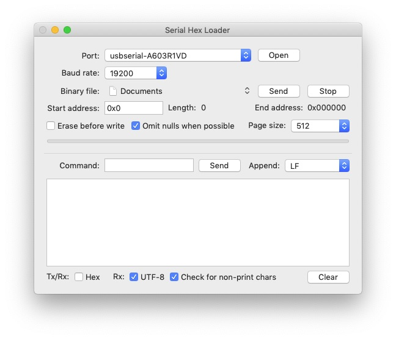

# SerialHexLoader

SerialHexLoader is an Objective-C OS X app that encodes any binary file to Intel HEX format then serially transfers the data to a target mcu running one of the copier programs supplied in this repository.  You can also simply export Intel HEX and transfer it using some other method.

This app can also be used as a serial monitor similar to Arduino's but with better UTF-8 handling and the ability to hex dump non printing characters.

A compiled version of the application is included in this repository.

Code used in this project:
* ORSSerialPort by Andrew Madsen  
	Copyright (c) 2014 Open Reel Software. All rights reserved.  
	[Github](https://github.com/armadsen/ORSSerialPort)  

# Usage
   
Via the Arduino IDE, load the HexLoader sketch configured to whatever device you're targeting on your board.

Launch SerialHexLoader.  Using command-open, select a binary file.  If you need to load the binary data to a specific memory location on the target device, use the “Start address” field to set the address.

Below the “Start address” field there are two checkboxes, “Erase before write” and “Omit nulls when possible”.

“Erase before write” applies only to NOR Flash chips because NOR Flash requires a block to be erased before writing.  Writing to NOR Flash only clears bits.  “Erase before write” will set all bits within an entire 64KB block to all 1's whenever a 64KB block boundary is crossed.  Be aware of this 64KB granularity when deciding on the starting address when using “Erase before write”.  If you’ve already erased the entire chip or block, uncheck “Erase before write”.  When the starting address is after the first byte of a 64K block, the block is not erased because this would erase all of the data in the block before the starting address.

When the “Omit nulls when possible” checkbox is checked, the page buffer is set to all nulls when crossing page boundaries by the HexLoader sketch.  This allows for optimized hex lines to be sent.  Only nulls in the middle of a line are sent, and only a single null is sent when an entire page is all nulls or a page starts with a null (to trigger a page boundary crossing.)  If the starting address is after the start of a page, the page is copied rather than initializing the entire page, and zeroed after the starting address.  This behavior depends on the device.  NOR Flash generally only allows complete pages to be written and AT24Cxxx EEPROMs are more random access.

When the “Omit nulls when possible” checkbox is checked, the Page size selected in the menu to the right of this checkbox should be the same size as the internal block size of the HexLoader sketch (currently 512.)

When the “Omit nulls when possible” checkbox is  unchecked the granularity of the data being sent is 16.  No nulls will be omitted therefore all lines are less than of equal to 16 data bytes in length (i.e. standard Intel HEX.)

Select and open the serial port using the Port menu and Open button.  You should see confirmation of opening the port in the log view.

If there were no connection errors, send the hex data to your board by pressing Send.  If the amount of data is large enough, you'll see the progress bar move as the loading progresses.  Depending on the target device you'll also get feedback in the log window.  When the send is complete you'll see "success!" in the log window.

